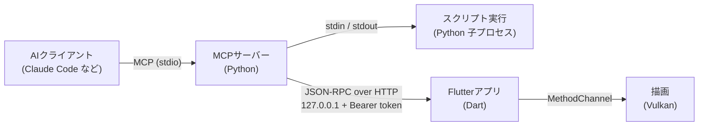

開発中のFlutterデスクトップアプリケーションにMCP連携機能を実験的につけてみた。


*MCP 経由で操作した開発中のアプリ。ロボットを開いて、隣にポメを置いて、カメラを回したところ（この画面自体も MCP の `capture` で撮った）*

つけた先は、社内で開発中の3Dを使うソフトウェアで、画面は Flutter、描画は Vulkan、で書いている。

Claude Code みたいな AI クライアントに「家のモデルを開いて、屋根を上から見て端から端を測って」と頼むと、AI はまず真上から見た画面を撮る。

```python
app.open(r"D:\Models\house.glb")
app.camera.snap("top")
```


*AI に返ってくる画像（1280×1011）*

AI はこの画像を見て、赤い線（X 軸）の高さで屋根の左端と右端の位置を決めて、アプリの計測ツールで測る。

```python
w, h = 1280, 1011
d = app.measure.distance((250 / w, 540 / h), (1030 / w, 540 / h))
print("端から端", round(d, 2), "m")
app.camera.snap("front")
app.camera.orbit(yaw_degrees=30, pitch_degrees=30)
app.camera.look_at([0, 2.5, 0], distance=17)
```

```text
端から端 8.99 m
```


*測ったあとにカメラを斜めに回したところ。家は軒先から軒先まで 9m で作ったモデル（これも Claude Code に Blender で作ってもらった）。*

画面の座標は、画像の大きさに関係ない0〜1の値でやりとりしている。なので AI は、見た画像のピクセル位置を幅と高さで割るだけで、そのまま計測やクリックの位置に使える。

モデルを開く、カメラを動かす、別のモデルを重ねる、測る、面を消す、サーバーに編集後のデータをあげられる、あたりまでできる。

冒頭の画像のロボットとポメは、前の記事でローカル生成したモデル。

https://zenn.dev/bestat/articles/local-image-to-3d-pixal3d

:::message
AI（Claude Code など）はクラウドの LLM。アプリと MCP サーバー、AI が書いた Python はローカルの PC で動く。
:::

## CLIかMCPか

個人的なAI利用の傾向で行くとMCPは使っておらずCLIがあるとうれしいのだが、たぶんこれはソフトウェアエンジニアの利用用途での考えで、GPTやClaude、Geminiのチャットのほう等、コーディングエージェントのようにCLIいじれるやつではないやつを使っている場合はMCPが必要になるんだと思う。MCPを作ればCLIも用意できるのでMCPから作ってみるのがよいと考えた。

## 構成



MCP サーバーはアプリに組み込まず、別プロセスの Python で動かしている。

AI クライアントが MCP サーバーを stdio のサブプロセスとして起動し、MCP サーバーは AI が書いた Python を毎回新しい子プロセスで実行する。子プロセスの中で `app.camera.snap("top")` を呼ぶと、1行の JSON になって親の MCP サーバーに渡り、親がアプリの JSON-RPC に投げる。アプリ側はローカルの HTTP サーバーで受けて、画面のボタンと同じ経路で処理する。

MCP サーバーを Dart で書いてアプリに入れる手もあったけど、分けたのはこのへんが理由。

- MCP の公式 Python SDK がそのまま使える
- AI に Python を書かせたいので、どのみち Python の実行環境はいる
- アプリが外に出すのは小さな JSON-RPC だけで済む。MCP の仕様が変わってもアプリ側はほぼ触らなくていい

## ツールは3つだけ

最初は「モデルを開く」「カメラを動かす」みたいに、操作ごとに MCP のツールを作るつもりだった。でも数えたら操作が50を超えていた。しかも「一覧から名前で探して、あったら開いて、上から見て測る」を1ツール1往復でやることになって、条件分岐も AI が会話の中で組み立てることになる。

なので [BlenderMCP](https://github.com/ahujasid/mcp-for-blender) のまねをして、ツールは3つにした。

```python
@mcp.tool()
async def get_state() -> str:
    """開いているモデル、選択 ID、カメラ、読み込み、実行中の操作を取得する。"""

@mcp.tool()
async def execute_script(code: str, capture_after: bool = True,
                         target: Literal["viewport", "ui"] = "viewport",
                         max_size: int = 1280, timeout: float = 60) -> CallToolResult:
    """信頼済み Python を別プロセスで実行し、stdout・result・状態と操作後の画像を返す。"""

@mcp.tool()
async def capture(target: Literal["viewport", "ui"] = "viewport", max_size: int = 1280) -> CallToolResult:
    """描画更新後の PNG を画像 content と状態 metadata で返す。"""
```

細かい操作は全部 `execute_script` の中で `app.*` を呼ぶ。API の一覧は FastMCP の `instructions` にまとめて書いておく。AI クライアントは接続したときにこれを読むので、ツールが3つでも何ができるかは伝わる。

```python
mcp = FastMCP("viewer", instructions=(
    "Use get_state to inspect the active viewer. execute_script runs synchronous Python with `app`.\n"
    "Server models: app.server.find(title_substring) / app.server.open(model) ...\n"
    "Measure: app.measure.distance(a, b) -> metres ...\n"
    # 以下、カメラ・編集・注釈・DXF・保存などの API を並べる
))
```

スクリプトなので、ループも条件分岐も座標の計算も1回の呼び出しで書ける。冒頭の画面は、このスクリプトを `execute_script` に1回渡しただけ。

```python
app.open(r"D:\Models\chibi-robot.glb", discard_changes=True)
robot = app.scene.bounds()
pom = app.scene.add_model(r"D:\Models\pom-axolotl.glb")
# ロボットの右隣に置いて、ロボットのほうへ向ける
x = robot["max"][0] + 0.45
pom = app.objects.set_transform(pom, translate=[x, 0, 0.1], rotate_degrees=[0, -50, 0])
app.selection.clear()
# 2体の間を、斜め前から見る
app.camera.snap("front")
app.camera.look_at([x * 0.7, 0.12, 0.0], distance=1.05)
app.camera.orbit(yaw_degrees=-25, pitch_degrees=12)
result = [obj["name"] for obj in app.scene.objects()]
```

`app.scene.bounds()` でロボットの大きさを取って、その右端からの距離でポメを置いている。こういう「結果を見て次の値を決める」処理を、ツールの往復なしで書けるのがスクリプトにしてよかったところ。

子プロセス側の `app` は、呼び出しを JSON にして親に書き出して、返事を待つだけ。

```python
def exchange(method, arguments):
    sys.__stdout__.write(json.dumps({"method": method, "arguments": arguments}) + "\n")
    sys.__stdout__.flush()
    response = json.loads(sys.__stdin__.readline())
    if "error" in response:
        raise RuntimeError(response["error"])
    return response["result"]
```

子プロセスにしておくと、無限ループになっても親が `kill` すれば止まるし、アプリにつなぐための token を子プロセスに渡さなくていい。ただ sandbox ではないので、AI が書いた Python はユーザーと同じ権限で動く。どのスクリプトを実行していいかは、AI クライアント側のツール承認に任せている。

## 操作後の画面を返す

3D ビュワーなので、AI が結果を目で見られないと話にならない。`execute_script` は、スクリプトが終わったら画面を撮って、テキストと画像を1つの `CallToolResult` で返す。

画像を返す価値は、Vision がついた LLM が効率よく作業できることだけじゃない。作業している人間も、LLM のチャット UI でそのまま作業結果を確認できる。指示して、結果を目で見て、また指示する、という流れがチャットの中で回せる。

```python
return CallToolResult(content=[
    TextContent(type="text", text=json.dumps(result, ensure_ascii=False)),
    ImageContent(type="image", mimeType="image/png", data=png_base64),
])
```

さっきのスクリプトを実行すると、AI にはこういうテキストと画像が返る（テキストは長いので一部だけ）。

```json
{
  "stdout": "",
  "result": ["chibi-robot.glb", "pom-axolotl.glb"],
  "capture": {
    "mime_type": "image/png", "width": 1600, "height": 938, "target": "viewport",
    "presented_frame": 108,
    "state": {
      "title": "chibi-robot.glb", "object_count": 2, "has_unsaved_changes": true,
      "camera": {"position": [-0.04, 0.34, 0.93], "target": [0.39, 0.12, 0.0], "mode_name": "orbit"}
    }
  }
}
```


*同じ応答で返ってくる画像。UI を除いた 3D の描画だけが写る*

モデルを追加したので `has_unsaved_changes` が `true` になっている。AI はこれを見て、保存するか、別のモデルを開く前に `discard_changes=True` をつけるかを判断できる。

撮るものは2種類ある。`viewport` は 3D の描画結果で、Flutter の画面ではなく Windows のネイティブ側で描画テクスチャを撮る。`ui` は Flutter の画面全体で、`RepaintBoundary` で撮る。ログイン画面や読み込みエラーを確認したいときはこっち。

画像は AI に渡す前に長辺1280pxとかに縮める。なので `app.scene.pick(u, v)` みたいな画面の座標は、ピクセルではなく0〜1の正規化座標でやりとりするようにした。縮小率に関係なく、同じ座標が同じ場所を指す。

## UI を止めない

アプリ側の RPC は Dart の `HttpServer` で受けている。モデルの読み込みみたいに数十秒かかる操作もあるので、RPC の応答では完了を待たずにジョブにしている。

| RPC | やること |
| --- | --- |
| `start_operation` | ジョブを登録して `job_id` だけ返す。実際の処理は応答のあとに始める |
| `get_operation` | 状態（`running` / `succeeded` / `failed` / `cancelled`）と結果を返す |
| `cancel_operation` | 取消を頼む |
| `clear_operation` | 終わったジョブを片づける。片づけるまで次の操作は `busy` で断る |

```dart
case 'start_operation':
  // ...引数の形だけ見る...
  if (_job != null) {
    throw const AutomationException('busy', '前の操作を poll / clear してから実行してください');
  }
  final _AutomationJob job = _AutomationJob(++_nextId, operation);
  _job = job;
  // 開始応答より前に snapshot 作成、ファイル検証、native 呼び出しを行わない。
  Timer.run(() => unawaited(_run(job, arguments)));
  return <String, Object?>{'job_id': job.id};
```

重い処理でアプリを「応答なし」にしないのは、このアプリでずっと気をつけているところ。RPC の入口では一瞬で終わるチェックと登録だけやって、ファイルの検証や読み込みは開始の応答を返してから始める。なので重い操作の最中でも `get_state` や取消にはすぐ返事ができる。撮影結果みたいな大きい JSON のエンコードは `Isolate.run` で UI isolate の外に出している。

同時に受ける操作は1つだけ。AI が前の操作の完了を待たずに次を投げてきても、画面の状態が混ざらない。

## 取消でハマったところ

一番時間を食ったのは取消だった。ユーザーが中断したときやタイムアウトしたとき、AI クライアントは MCP の取消通知を送ってくる。そのときはアプリ側のジョブも取り消して、片づけまで終わらせたい。

### 後片づけまで一緒に取り消される

MCP サーバーは、ジョブが終わったときや取消のときに `cancel_operation` → 完了待ち → `clear_operation` を送る。最初は `try/finally` に書いただけだった。

```python
try:
    ...  # get_operation で完了を待つ
finally:
    await self._cancel_and_clear(job_id)
```

ところが公式 Python SDK は、ツールの取消を AnyIO の `CancelScope` でやる。取り消されたスコープの中では `finally` の中の `await` もすぐ取り消されるので、`clear_operation` がアプリに届かず、終わったジョブが残る。次の操作は全部 `busy` で断られる。

そこで後片づけを `anyio.CancelScope(shield=True)` で守った。応答しないアプリを無限に待たないように期限もつけた。

これでもまだ漏れがあった。`shield` が防げるのは AnyIO 経由の取消だけで、スクリプトのタイムアウトを `asyncio.timeout()` で書いていたせいで、タイムアウトの取消は `shield` をすり抜けていた。最終的にこの2つを入れた。

- タイムアウトも `anyio.fail_after()` にそろえて、AnyIO の経路で取り消す
- 後片づけは独立した `Task` で走らせる。待っている間に `Task.cancel()` が来ても、片づけが終わってから取消を呼び出し元に伝える

```python
async def _shielded_cleanup(self, cleanup, job_id):
    loop = asyncio.get_running_loop()
    task = asyncio.ensure_future(cleanup())
    deadline = loop.time() + self.CLEANUP_SECONDS
    cancelled = False
    with anyio.CancelScope(shield=True):
        while not task.done():
            remaining = deadline - loop.time()
            if remaining <= 0:
                break
            try:
                # asyncio.wait は待つ側が取り消されても、後片づけの Task は取り消さない
                await asyncio.wait({task}, timeout=remaining)
            except asyncio.CancelledError:
                cancelled = True
    if not task.done():
        task.cancel()
        raise ControlError(f"Cleanup did not finish in time; inspect job_id={job_id} with get_state")
    if cancelled:
        raise asyncio.CancelledError()  # 片づけが終わってから取消を伝える
    return task.result()
```

期限を過ぎたら、成功とも取消完了とも言わずに、ジョブ ID つきのエラーで失敗させる。ジョブ ID があれば、あとから `get_state` で様子を見られる。

テストでは、実際の stdio セッションに `CancelledNotification` を送るのに加えて、「`clear_operation` を送っている最中にタイムアウトが来る」「`clear_operation` を送っている最中に `Task.cancel()` が来る」の順番もそれぞれ試している。最初は「取消が来てから片づけを始める」順番しか試してなくて、片づけの途中で初めて取消が来るパターンを見落としていた。

### 描画だけ動いて画面の状態が置いていかれる

アプリ側にも取消の落とし穴があった。たとえば追加したモデルを動かす操作はこういう順で進む。

1. ネイティブ（C++）に新しい位置を送る
2. Flutter の状態（Riverpod の provider）を更新する。数値欄や「未保存の変更あり」はここから決まる

1と2の間で取消をチェックすると、描画ではモデルが動いたのに、数値欄も未保存フラグも古いまま、ということが起きる。ネイティブが受け付けた変更は、取消より先に画面の状態に反映しないといけない。なので順番を共通の関数に固定した。

```dart
Future<T> commitAutomationNativeChange<T>({
  required Future<T> Function() native,
  required void Function() checkSession,
  required FutureOr<void> Function(T accepted) reflect,
  required AutomationCancellation cancellation,
}) async {
  final T accepted = await native();  // 1. ネイティブに反映
  checkSession();                     // 2. 画面が切り替わっていないか
  await reflect(accepted);            // 3. 受け付けられた変更を provider に反映
  cancellation.check();               // 4. ここで初めて取消を見る
  return accepted;
}
```

## インストーラー版で使う

開発中は `uv run` で MCP サーバーを起動していた。でもインストーラーでアプリをもらった人の PC には、Python も uv も入っていないかもしれない。

なので Blender や DaVinci Resolve と同じように、Python の実行環境ごとインストーラーに入れた。

使う人の手順はこれだけ。

1. アプリの設定で「AI からの操作を許可する」をオンにする
2. 「Claude Code 用コマンドをコピー」を押して、ターミナルに貼って実行する（Claude Desktop などには MCP 設定の JSON をコピーするボタンがある）
3. あとは AI に頼む

コピーされるのは、同梱の Python を指すこういうコマンド。

```bash
claude mcp add <名前> -- "<インストール先>\mcp\python\python.exe" -m <MCPサーバーのモジュール>
```

ポートと token はアプリを起動するたびにランダムに作り直していて、ユーザーごとのフォルダーにある接続情報のファイルに書き出す。MCP サーバーは RPC のたびにこのファイルを読み直すので、アプリを再起動してポートが変わっても、AI クライアントの設定はそのままでいい。

## セキュリティ

ローカルとはいえ HTTP で待ち受けるので、受ける要求はかなり絞った。

- `127.0.0.1` だけで bind して、Bearer token を必須にする
- `Origin` ヘッダーつきの要求は断る（ブラウザーのページからの要求を通さないため）。`Host` も見る
- ローカルのファイルは、設定画面で許可したフォルダーの中だけ開ける
- アプリに渡せるのは登録済みの操作だけ。任意のネイティブメソッドやソースコードは送れない

一方で、さっき書いたとおり Python のスクリプト自体はユーザーの権限でそのまま動く。ここは sandbox で守るのではなく、AI クライアント側の承認で止める方針にした。

## Pythonでいいのか

Blender や DaVinci Resolveを参考に実装したのでPython実行環境を同梱する形になったが、そもそもこれらのアプリケーションはMCP登場以前からスクリプト操作をやるためにPythonが入っててそれを流用したに過ぎない可能性があるため、ベストプラクティスかは怪しい。MCPに接続したLLMがPythonで任意コード実行できてしまうため、このアプリケーションに限らない操作をなんでもできてしまうからだ

このように→

@[tweet](https://x.com/umiyuki_ai/status/2103754259938398242)

## テスト

Python 側は `unittest` で、偽物のアプリを相手に MCP サーバーとスクリプト実行を試している。取消のテストは、さっき書いたように本物の stdio セッションに取消通知を送る。

Flutter 側は `flutter drive --profile` の integration test で、本物の画面、ローカル RPC、stdio の MCP サーバー、Python の子プロセス、ネイティブの撮影まで一通り動かしている。開始の応答と、処理中の `get_state` が1秒未満で返ることもここで見ている。

## 雑感

つーかComputer Useでよくね感がヤバいが、AIに聞いたらモデルの境界を取得して隣に配置する、といった処理は、画面クリックだけでやるより直接的でComputer Useと併用して使う価値がある。らしい

## 参考

https://github.com/ahujasid/mcp-for-blender

外からつないでコードを実行して、画像を返す構成はこれを参考にした。

https://github.com/modelcontextprotocol/python-sdk

ツールを細かく分けずにスクリプトを丸ごと渡す形にしたので、アプリに操作を足しても MCP のツールは増えない（instructions に1行足すくらい）。そのぶん取消まわりは、テストを書くまで穴に気づけなかった。
